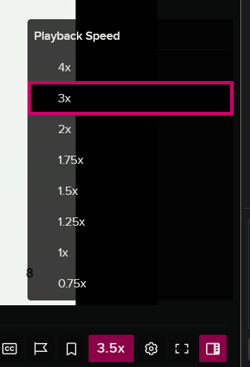

# Echo360 super speed userscript

> _Note that this project is not endorsed by or affiliated with Echo360_

### [Install userscript](https://github.com/peter-tanner/Echo360-Super-Speed/raw/master/echo360-super-speed.user.js)

### [Mirror (Greasyfork)](https://greasyfork.org/en/scripts/501694-echo360-super-speed)

Adds faster speed options (4x, 3x) to Echo360 player and allows the user to add their own speed options.



## Adding your own speeds

Open the userscript file, then modify the `selected_speeds` and/or `speed_hotkey_increment` constants which are in the `USER CUSTOMIZATION` section.

For example, if I wanted only 4x, 3x and 2x options, I can replace the `selected_speeds` constant with the following:

```js
const selected_speeds = [4, 3, 2];
```

⚠ Note that there is a browser set limit of 16x, and speeds above 4x are muted, according to [these constants in the firefox source code](https://searchfox.org/mozilla-central/rev/f1c881ba5603410dacbe52874053af38bd825c3b/dom/html/HTMLMediaElement.cpp#179-183)

## Current issues

- When setting `selected_speeds` to a list of speeds which does not include 1x, the player by default loads with 1x speed when the page is loaded. Once the speed is changed manually by clicking on a speed from the dropdown this is not an issue anymore, but it would be nice if the default speed was valid.
